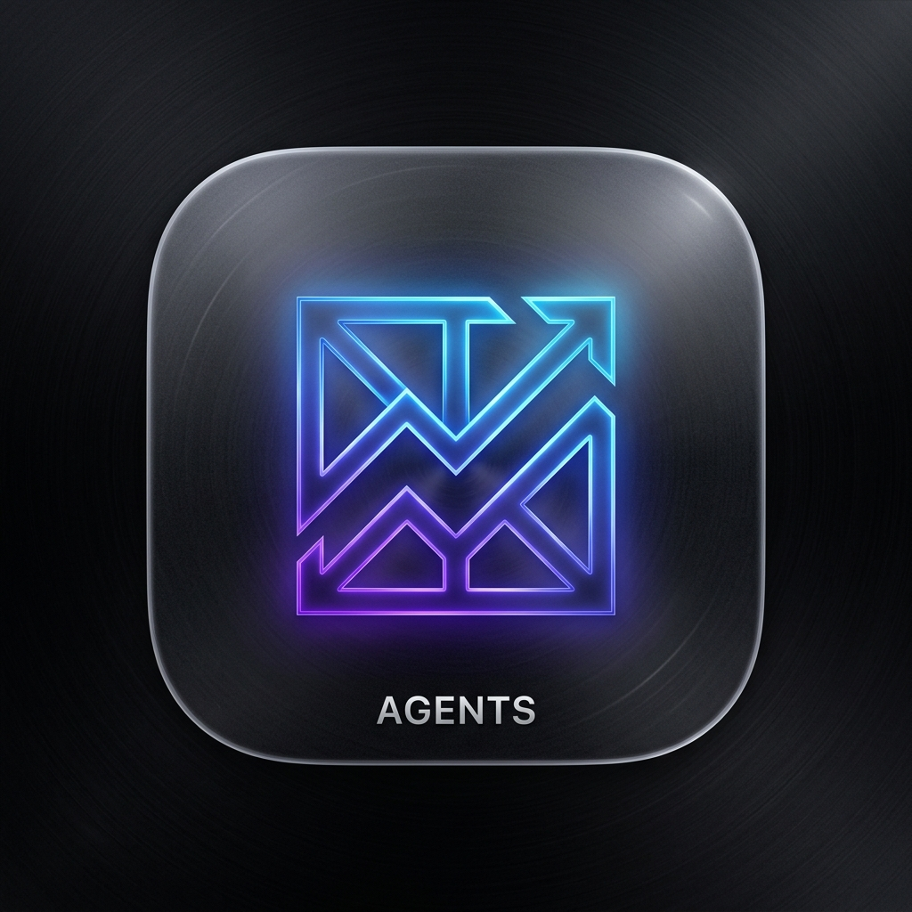

#  Agents | 프리미엄 자산 관리 매니저

**Agents**는 개인 투자자의 주식 및 자산 현황을 가장 우아하고 직관적으로 관리할 수 있도록 설계된 모바일 최적화 웹 애플리케이션입니다. 단순한 금액 기록을 넘어, 입출금 노이즈를 제거한 순수 자산 성과를 시장 지수와 비교 분석하여 당신의 투자 실력을 객관적으로 증명해 드립니다.

---

## ✨ 핵심 기능

### 1. 프리미엄 대시보드 (Dashboard)
- **Apple HIG 준수**: 아이폰의 감성을 그대로 담은 글래스모피즘(Glassmorphism) UI와 부드러운 애니메이션.
- **실시간 지수 비교**: S&P 500, KOSPI, NASDAQ의 실제 시장 데이터를 실시간으로 불러와 내 자산 수익률과 즉시 비교.
- **다중 필터링**: '국내/해외', '공격형/안정형' 등 카테고리 조합을 통한 스마트한 계좌 뷰 전환.

### 2. 정밀한 자산 기록 및 분석
- **입출금 노이즈 제거**: 단순 입금으로 인한 자산 증가는 제외하고, 오직 투자 실력에 의한 '순수 증감'만을 차트로 시각화.
- **자동 로그 시스템**: 계좌 잔액을 직접 수정하면 이전 잔액과의 차이를 계산하여 자동으로 입출금 내역을 생성.
- **과거 데이터 복원**: 앱 시작 이전의 과거 자산 기록을 날짜별로 수동 입력하여 장기적인 포트폴리오 히스토리 구축 가능.

### 3. 모바일 앱 경험 (PWA)
- **홈 화면 추가**: 브라우저 주소창 없이 실제 설치형 앱처럼 구동되는 PWA(Progressive Web App) 기술 적용.
- **전용 아이콘**: 홈 화면에 최적화된 프리미엄 디자인 아이콘 제공.

---

## 🛠 사용 방법

### 1. 배포 및 실행
- 본 저장소의 `index.html`과 `icon.png` 파일을 웹 호스팅(GitHub Pages 등)에 업로드하거나, 로컬에서 브라우저로 실행하세요.

### 2. 아이폰/안드로이드에서 앱처럼 사용하기
1. 모바일 브라우저(Safari/Chrome)로 배포된 URL에 접속합니다.
2. **'공유하기'** 버튼(아이폰) 또는 **'설정'** 메뉴(안드로이드)를 클릭합니다.
3. **'홈 화면에 추가'**를 선택합니다.
4. 홈 화면에 생성된 **Agents** 아이콘을 눌러 앱을 시작하세요.

---

## 🏗 기술 스택
- **Core**: Vanilla JavaScript (ES6+), HTML5, CSS3
- **Visualization**: Chart.js
- **Icons**: Lucide Icons
- **Data Fetching**: Yahoo Finance API (via CORS Proxy)
- **Storage**: LocalStorage (모든 데이터는 사용자 기기에만 안전하게 저장됩니다)

---

## 🎨 디자인 원칙
- **Minimalism**: 복잡한 기능을 배제하고 핵심 자산 정보에 집중.
- **Aesthetics**: 다크 모드 기반의 세련된 컬러 팔레트와 타이포그래피.
- **Responsiveness**: 한 손 조작에 최적화된 모바일 퍼스트 레이아웃.

---

## 📑 라이선스 및 제작
본 프로젝트는 **Agents 에이전트 팀**에 의해 설계되었으며, 사용자의 투자 성공을 돕기 위해 제작되었습니다.

> **"당신의 자산은 단순한 숫자가 아닙니다. 그 뒤에 숨겨진 진정한 성장 스토리를 Agents와 함께 기록하세요."**

---

> AI로 작성한 웹입니다.
